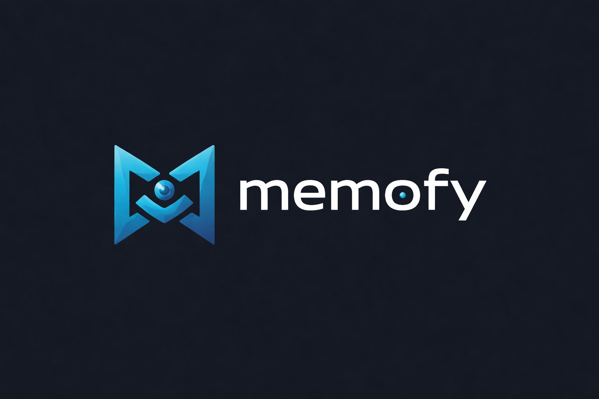

# Memofy your meetings



Memofy is a macOS menu bar application that automatically detects and records Zoom, Microsoft Teams, and Google Meet meetings via OBS using intelligent detection and stable state control.

## Features

- **Automatic Detection**: Detects Zoom, Microsoft Teams, and Google Meet meetings in real-time with smart debounce (3/6)
- **Intelligent Recording**: Anti-flap logic prevents short interruptions from fragmenting recordings
- **Menu Bar Control**: Native macOS status display with quick-access controls
- **Manual Override**: Force start/stop recording regardless of meeting detection
- **OBS Integration**: Uses OBS WebSocket v5 for stable, reliable recording control
- **Native Notifications**: macOS notifications for recording start/stop and errors
- **Settings UI**: Adjust detection rules and thresholds from menu
- **Smart Filenames**: Automatic renaming to `YYYY-MM-DD_HHMM_Application_Title.mp4`
- **File-based IPC**: Daemon and UI communicate via status/command files
- **Auto-start**: LaunchAgent ensures daemon runs at login
- **Comprehensive Logging**: Detailed logs with 10MB rotation for troubleshooting
- **Automated Releases**: GitHub Actions CI/CD pipeline with automatic multi-platform builds
- **Self-Updating**: One-click updates from menu bar with release channel preferences

## System Requirements

- macOS 11.0 (Big Sur) or later
- OBS Studio 28.0+ with WebSocket server enabled
- Go 1.21+ (for building from source)

## Quick Start

### 1. Prerequisites

**OBS Setup**:
1. Install [OBS Studio](https://obsproject.com/)
2. Enable WebSocket server:
   - Open OBS
   - Go to `Tools > obs-websocket Settings`
   - Enable "Enable WebSocket server" checkbox
   - Set port to `4455` (default) with no password
3. Optional: Pre-configure recording output path (e.g., `~/Movies`)

**Automatic Setup**:
Memofy will **automatically** on first run:
- ✅ Start OBS if not running
- ✅ Create audio capture source if missing
- ✅ Create display capture source if missing

See [OBS_AUTO_INITIALIZATION.md](OBS_AUTO_INITIALIZATION.md) for details.

**macOS Permissions**:
- Grant **Screen Recording** permission to Terminal (for daemon)
- Grant **Accessibility** permission to Terminal (for process detection)

### 2. Installation

**One-Command Installation** (Recommended):
```bash
# Clone and install in one command
git clone https://github.com/tiroq/memofy.git
cd memofy
bash scripts/quick-install.sh
```

That's it! The script will:
- ✅ Check and install prerequisites (OBS, Go)
- ✅ Build or download pre-compiled binaries
- ✅ Install daemon and menu bar app
- ✅ Start the menu bar UI
- ✅ Guide you through OBS setup

**Manual Installation** (if needed):
```bash
# Clone repository
git clone https://github.com/tiroq/memofy.git
cd memofy

# Using Task (recommended)
task build
task install

# Or using Make
make build
make install

# Start menu bar UI
~/.local/bin/memofy-ui
```

**Note**: This project supports both [Task](https://taskfile.dev/) (recommended) and Make. 
See [Taskfile Guide](docs/TASKFILE_GUIDE.md) for Task usage.

**Install from Pre-Built Release**:
```bash
# Download and install latest release
cd ~/Downloads
bash <(curl -fsSL https://raw.githubusercontent.com/tiroq/memofy/main/scripts/quick-install.sh)
```

### 3. Usage

**Menu Bar UI**:
The menu bar application displays meeting status and provides quick controls:

- Status Icons:
  - ⚪ **IDLE** (white): Not recording, no meeting detected
  - 🟡 **WAIT** (yellow): Meeting detected, waiting for threshold
  - 🔴 **REC** (red): Actively recording
  - ⏸ **PAUSED** (pause symbol): Detection paused
  - ⚠️ **ERROR** (warning): Connection or permission error

- Menu Controls:
  - **Start Recording**: Manually start recording (switches to manual mode)
  - **Stop Recording**: Manually stop recording
  - **Auto Mode**: Automatic detection-based control (default)
  - **Manual Mode**: Continuous recording, requires manual stop
  - **Pause**: Suspend all detection and recording
  - **Open Recordings Folder**: Opens OBS output directory
  - **Open Logs**: View daemon logs for debugging
  - **Settings**: Configure detection rules and thresholds
  - **Check for Updates**: Check if a newer version is available
  - **Update Now**: Download and install the latest version automatically

**Auto-Update**:
- Menu bar automatically checks for updates once per hour
- Desktop notification appears when new version is available
- Click "Update Now" to install the latest version automatically
- Binary is downloaded from GitHub Releases and installed
- Configuration-based release channel (stable or pre-release)
- See [Release Channel Configuration](docs/RELEASE_CHANNEL_CONFIGURATION.md) for details

**Release Channels**:
- **Stable** (default): Only stable releases (v0.2.0, v0.3.0)
- **Pre-release**: Includes beta and RC versions (v0.2.0-rc1)
- Configure via `~/.config/memofy/detection-rules.json` (`allow_dev_updates` flag)
- See [Quick Reference](docs/RELEASE_UPDATE_QUICK_REFERENCE.md) for usage

**Settings UI**:
Click "Settings" in the menu to:
- Modify process names for Zoom and Teams detection
- Adjust window title hints for meeting identification
- Configure start/stop detection thresholds
- Validate and save configuration

**Notifications**:
The app sends native macOS notifications for:
- Recording started/stopped with duration
- Mode changes (Auto/Manual/Pause)
- Detection of meetings
- Errors with actionable guidance

**Command-Line Control** (alternative):
If menu bar is unavailable, control daemon via:
```bash
# Start recording manually
echo 'start' > ~/.cache/memofy/cmd.txt

# Stop recording
echo 'stop' > ~/.cache/memofy/cmd.txt

# Switch to auto mode
echo 'auto' > ~/.cache/memofy/cmd.txt

# Pause detection
echo 'pause' > ~/.cache/memofy/cmd.txt

# Check current status
cat ~/.cache/memofy/status.json | jq
```

**Files and Paths**:
- **Config file**: `~/.config/memofy/detection-rules.json` (editable via Settings menu)
- **Status file**: `~/.cache/memofy/status.json` (read-only, updated by daemon)
- **Command file**: `~/.cache/memofy/cmd.txt` (write to send commands)
- **Log files**: `/tmp/memofy-core.out.log` and `/tmp/memofy-core.err.log`
- **LaunchAgent**: `~/Library/LaunchAgents/com.memofy.core.plist`

## Architecture

### Components

**memofy-core** (Daemon):
- Runs as LaunchAgent (auto-starts at login)
- Polls every 2 seconds for meeting detection
- Controls OBS recording via WebSocket
- Writes status updates to `status.json`
- Reads commands from `cmd.txt`

**memofy-ui** (Menu Bar App):
- Displays status icon and menu
- Monitors `status.json` for updates (fsnotify)
- Writes user commands to `cmd.txt`
- Opens Finder windows and logs

### Detection Logic

**Zoom Meeting**:
- Process: `zoom.us` running
- AND (Host process: `CptHost` OR Window title hint)

**Teams Meeting**:
- Process: `Microsoft Teams` running
- Window title hints: configurable patterns

**Google Meet**:
- Browser running: Chrome, Safari, Firefox, Edge, Brave
- Window title hints: "Google Meet" or "meet.google.com"

**Debounce Thresholds**:
- Start: 3 consecutive detections (6-9 seconds)
- Stop: 6 consecutive non-detections (12-18 seconds)

### Recording Filename Format

```
YYYY-MM-DD_HHMM_Application_Title.mp4
```

Example: `2024-02-12_1430_Zoom_Meeting.mp4`

## Configuration

Edit `~/.config/memofy/detection-rules.json`:

```json
{
  "rules": [
    {
      "application": "zoom",
      "process_names": ["zoom.us"],
      "window_hints": ["Zoom Meeting"],
      "enabled": true
    },
    {
      "application": "teams",
      "process_names": ["Microsoft Teams"],
      "window_hints": ["Meeting", "Call"],
      "enabled": true
    },
    {
      "application": "google_meet",
      "process_names": ["Google Chrome", "Safari", "Firefox"],
      "window_hints": ["Google Meet", "meet.google.com"],
      "enabled": true
    }
  ],
  "poll_interval_seconds": 2,
  "start_threshold": 3,
  "stop_threshold": 6
}
```

**Tuning**:
- `start_threshold`: Lower = faster start (more false positives)
- `stop_threshold`: Higher = prevents fragmentation (slower stop)
- `window_hints`: Add app-specific keywords from window titles

## Troubleshooting

### Daemon Not Starting

```bash
# Check LaunchAgent status
launchctl list | grep memofy

# View error logs
tail -f /tmp/memofy-core.err.log

# Manually start daemon for debugging
~/.local/bin/memofy-core
```

### No Recording Starts

1. **Check OBS Connection**:
   ```bash
   # Verify WebSocket settings in OBS
   # Tools > obs-websocket Settings > Enable
   ```

2. **Check Detection**:
   ```bash
   # View detection logs
   tail -f /tmp/memofy-core.out.log | grep Detection
   ```

3. **Check Permissions**:
   - System Preferences > Security & Privacy > Screen Recording
   - System Preferences > Security & Privacy > Accessibility

### Recording Fragments (Multiple Files)

- Increase `stop_threshold` in detection rules
- Check for network interruptions during Zoom/Teams calls
- Verify CptHost process stays running during Zoom meetings

### Black Screen in Recordings

- Grant Screen Recording permission to OBS
- Ensure OBS window capture is configured correctly
- Check that auto-created display capture source is enabled

### OBS Auto-Initialization Issues

**OBS Won't Auto-Start**:
- Ensure OBS is installed: `ls -d /Applications/OBS.app`
- Manually start OBS: `open -a OBS`
- Check daemon logs for errors: `tail -f /tmp/memofy-core.err.log`

**WebSocket Server Error**:
- Verify WebSocket is enabled: `Tools > obs-websocket Settings`
- Restart OBS after enabling WebSocket
- Check port 4455 is not in use: `lsof -i :4455`

**Sources Not Auto-Created**:
- Check daemon logs: `grep -i "sources\|source" /tmp/memofy-core.out.log`
- Manually create sources in OBS:
  1. Click "+" in Sources panel
  2. Add "Audio Input Capture"
  3. Add "Display Capture"
- See [OBS_AUTO_INITIALIZATION.md](OBS_AUTO_INITIALIZATION.md) for details

## Development

### Prerequisites

- Go 1.21+
- [Task](https://taskfile.dev/) (recommended) or Make
- OBS Studio 28.0+

### Building

With Task (recommended):
```bash
# Build both binaries
task build

# Build individual components
task build-core
task build-ui

# Install locally
task install

# Run tests
task test

# Run linter
task lint

# Generate test coverage
task test-coverage

# Clean build artifacts
task clean

# List all available tasks
task --list
```

Or with Make:
```bash
# Build both binaries
make build

# Run tests
make test

# Clean build artifacts
make clean
```

See [Taskfile Guide](docs/TASKFILE_GUIDE.md) for complete Task usage documentation.

### Project Structure

```
memofy/
├── .github/
│   └── workflows/      # GitHub Actions CI/CD
│       ├── release.yml # Automated releases
│       └── ci.yml      # Testing pipeline
├── cmd/
│   ├── memofy-core/    # Daemon main
│   └── memofy-ui/      # Menu bar UI main
├── internal/
│   ├── detector/       # Meeting detection logic
│   ├── statemachine/   # Debounce state machine
│   ├── obsws/          # OBS WebSocket client
│   ├── ipc/            # Status/command file handlers
│   ├── config/         # Configuration loading
│   └── autoupdate/     # Auto-update system
├── pkg/
│   └── macui/          # macOS menu bar UI components
├── scripts/
│   ├── com.memofy.core.plist   # LaunchAgent plist
│   ├── install-launchagent.sh  # Installation script
│   ├── quick-install.sh        # One-command installer
│   ├── build-release.sh        # Local release builder
│   └── uninstall.sh            # Uninstallation script
├── configs/
│   └── default-detection-rules.json
├── docs/
│   ├── RELEASE_CHANNEL_CONFIGURATION.md # Release channel guide
│   ├── RELEASE_PROCESS_GUIDE.md         # Maintainer guide
│   ├── AUTO_UPDATE_SYSTEM.md            # Update system details
│   ├── RELEASE_UPDATE_QUICK_REFERENCE.md # Quick reference
│   └── TASKFILE_GUIDE.md                # Task usage guide
├── Taskfile.yml        # Task runner configuration (recommended)
├── Makefile
└── README.md
```

### Dependencies

- `github.com/gorilla/websocket` - OBS WebSocket v5 client
- `github.com/progrium/darwinkit` - macOS native APIs (NSStatusBar, NSWorkspace)
- `github.com/fsnotify/fsnotify` - File system notifications

## Uninstallation

```bash
./scripts/uninstall.sh
```

## License

This project is licensed under the MIT License - see the LICENSE file for details.

## Acknowledgments

- [OBS Studio](https://obsproject.com/) - Recording software
- [obs-websocket](https://github.com/obsproject/obs-websocket) - OBS remote control
- [progrium/darwinkit](https://github.com/progrium/darwinkit) - macOS Go bindings

## Documentation

- **User Guides**:
  - [Installation Guide](INSTALLATION_GUIDE.md) - Comprehensive installation instructions
  - [Release Channel Configuration](docs/RELEASE_CHANNEL_CONFIGURATION.md) - Configure stable vs pre-release updates
  - [Quick Reference](docs/RELEASE_UPDATE_QUICK_REFERENCE.md) - Common commands and workflows

- **Developer Guides**:
  - [Taskfile Guide](docs/TASKFILE_GUIDE.md) - Task runner usage (recommended build tool)
  - [OBS Auto-Initialization](OBS_AUTO_INITIALIZATION.md) - Automatic OBS setup
  - [Quick Install Implementation](QUICK_INSTALL_IMPLEMENTATION.md) - Installation script details

- **Technical Documentation**:
  - [Auto-Update System](docs/AUTO_UPDATE_SYSTEM.md) - Update system architecture

- **Maintainer Guides**:
  - [Release Process Guide](docs/RELEASE_PROCESS_GUIDE.md) - How to publish releases
  - [Release Channel Implementation](docs/RELEASE_CHANNEL_IMPLEMENTATION.md) - Technical implementation details

## Future Enhancements

- Audio activity detection for more reliable meeting detection
- Automatic transcription integration
- Calendar-based recording triggers
- AI-powered meeting summaries
- Indexed meeting archive with search
